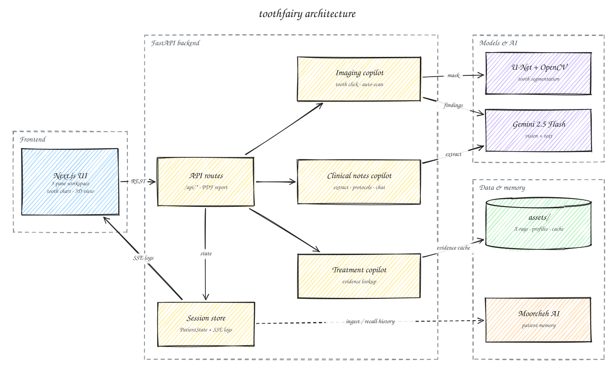

# toothfairy

*One click. Every diagnosis. Zero tab switching.*

toothfairy is a Cursor-inspired, AI-assisted dentistry workspace built for both sides of the chair. Dentists get X-ray analysis, clinical-notes extraction, and treatment planning in one three-pane IDE instead of a pile of disconnected tools. Patients get a color-coded tooth chart, plain-language summaries, treatment timelines, and a downloadable PDF report instead of a blurry X-ray and a nod. Patient profiles and visit history persist across sessions, so dentist and patient see the same picture: current findings, past treatment, and what comes next.

> Fork of [7kzaincode/toothfairy](https://github.com/7kzaincode/toothfairy). All credit for the original project goes to the upstream team (see [Team](#team)).

## Demo

<div style="display: flex; flex-wrap: wrap; gap: 10px;">
  
  
  
  
  
  
</div>

## Architecture



- **Next.js UI**: a three-pane workspace (patient/profile pane, center viewer tabs, copilot log pane) with an SVG tooth chart, a Three.js 3D tooth model, an X-ray viewer with segmentation overlays, and a Cmd/Ctrl+K command palette. It calls the backend over REST.
- **API routes** (`backend/app/api/routes`): FastAPI endpoints for sessions, profiles, image upload and listing, the three copilot actions, and a per-session PDF report (`GET /api/session/{id}/report`, built with ReportLab).
- **Session store**: an in-memory `PatientState` per session that every copilot writes into. Copilot progress logs are pushed to the UI live over Server-Sent Events (`GET /api/stream/{session_id}`).
- **Imaging copilot**: when you click a tooth, it maps the click to an FDI tooth number and isolates that tooth with the U-Net mask. Auto-scan segments the whole panoramic X-ray. Findings come from the demo cache first, then Gemini vision.
- **U-Net + OpenCV**: a TensorFlow/Keras U-Net (adapted from SerdarHelli's panoramic-teeth model) produces a tooth mask. Connected-component analysis and contour extraction split it into individual teeth. See [TOOTH_SEGMENTATION.md](TOOTH_SEGMENTATION.md).
- **Clinical notes copilot**: takes highlighted note text, uses Gemini 2.5 Flash to extract structured diagnoses, maps them to treatment protocols (CDT codes, cost ranges), and builds a timeline. It also offers a chat endpoint that can use the patient's history.
- **Treatment copilot**: looks up evidence for a condition. It currently serves curated evidence from `assets/cache/treatment/evidence/`. A Gemini + MCP (PharmacyMCP) tool-calling path exists in code but is disabled.
- **assets/**: sample X-rays, patient profile JSON files, and pre-computed cache data used in demo mode.
- **Moorcheh AI** (optional): per-patient memory namespaces. Copilot results are ingested after each action, and clinical-notes chat recalls prior visits. The feature is skipped if `MOORCHEH_API_KEY` or the SDK is missing.

## Features

- Click any tooth on a panoramic X-ray to segment it and get findings, or auto-scan every tooth in one pass
- Highlight clinical notes to extract diagnoses, with matching treatment protocols, CDT codes, and costs
- Interactive 2D tooth chart and 3D teeth model, colored by findings
- Treatment table and timeline per patient
- Live copilot activity log streamed over SSE
- Persistent patient profiles with linked X-rays and dental history
- Downloadable PDF report for the patient or insurance
- Demo mode (`DEMO_MODE=true`, or toggle at runtime via `POST /api/demo-mode`) that serves cached results instead of calling live APIs

## Tech stack

| Layer | Tools |
|-------|-------|
| Frontend | Next.js 16, React 19, TypeScript, Tailwind CSS 4, Three.js (`@react-three/fiber`, `drei`) |
| Backend | FastAPI, Pydantic, Uvicorn, `sse-starlette` |
| LLM / vision | Google Gemini 2.5 Flash (`google-genai`) |
| Segmentation | TensorFlow/Keras U-Net, OpenCV, NumPy, Pillow |
| Memory | Moorcheh AI SDK |
| Reports | ReportLab |
| Optional inference service | MedSAM2 on Modal / Replicate (`backend/inference/`) |

## Getting started

### Prerequisites

- Node.js 18+ and npm
- Python 3.10+
- Git LFS (the ~154 MB U-Net weights live in `backend/models/` and are tracked with LFS)

### 1. Clone

```bash
git clone https://github.com/7kzaincode/toothfairy.git
cd toothfairy
git lfs pull
```

### 2. Backend

```bash
cd backend
pip install -r requirements.txt
# Also used by the code but not listed in requirements.txt:
pip install tensorflow opencv-python reportlab
```

Create `backend/.env` using these variables (names only):

| Variable | Purpose |
|----------|---------|
| `GOOGLE_API_KEY` | Gemini API key (required unless `DEMO_MODE=true`) |
| `DEMO_MODE` | `true` to serve cached results from `assets/cache/` |
| `MOORCHEH_API_KEY` | Optional. Enables patient memory |
| `ASSETS_ROOT_DIR`, `CACHE_ROOT_DIR` | Optional. Override the default `assets/` and `assets/cache/` paths |
| `MODAL_ENDPOINT_URL`, `MEDSAM_MODEL_SIZE` | Optional. MedSAM2 inference endpoint and model size |
| `IMAGING_INFERENCE_TIMEOUT_SECONDS`, `EVIDENCE_API_TIMEOUT_SECONDS` | Optional timeouts |
| `HOST`, `PORT`, `DEBUG` | Server settings when you run `python -m app.main` |

Run it from `backend/`:

```bash
uvicorn app.main:app --reload --port 8000
```

Interactive API docs are served at http://localhost:8000/docs.

### 3. Frontend

From the repo root:

```bash
npm install
npm run dev
```

Open http://localhost:3000. The frontend uses `http://localhost:8000` by default. Set `NEXT_PUBLIC_API_URL` to point it at a different backend.

### Optional: MedSAM2 inference service

`backend/inference/` is a separate GPU deployment for Modal (`modal deploy modal_medsam2.py`) or Replicate (`cog.yaml`). See [backend/inference/README.md](backend/inference/README.md). The backend uses the in-process U-Net by default.

## Project structure

```
toothfairy/
├── src/                      # Next.js frontend
│   ├── app/                  # page.tsx (three-pane layout), layout, styles
│   ├── components/
│   │   ├── layout/           # Left/Center/Right panes, command palette, landing popup
│   │   ├── viewers/          # X-ray viewer, segmentation overlay, tooth chart, notes, treatment
│   │   └── 3d-viewer/        # Three.js teeth model
│   ├── hooks/                # usePatientState, useCopilot, useSSE
│   └── lib/                  # API client + SSE client
├── backend/
│   ├── app/
│   │   ├── main.py           # FastAPI app, SSE stream, demo-mode toggle
│   │   ├── api/routes/       # session, profiles, imaging, clinical_notes, treatment
│   │   ├── copilots/         # imaging, clinical_notes, treatment handlers
│   │   ├── services/         # Gemini, U-Net segmentation, Moorcheh, MCP, PDF report
│   │   ├── core/             # config, session/profile/cache managers, log emitter
│   │   └── models/           # Pydantic models (PatientState, etc.)
│   ├── models/               # U-Net weights (Git LFS)
│   └── inference/            # Optional MedSAM2 deployment (Modal / Replicate)
├── assets/                   # Sample X-rays, patient profiles, demo cache
├── public/                   # Static files, 3D teeth model, fonts
└── docs/                     # Architecture diagram and notes
```

## Team

toothfairy was built by the upstream team at [7kzaincode/toothfairy](https://github.com/7kzaincode/toothfairy):

- [7kzaincode](https://github.com/7kzaincode)
- Aidan Jeon ([aidanjnn](https://github.com/aidanjnn))
- Abe Kuk
- Michelle Jeon

The tooth segmentation model is adapted from [SerdarHelli/Segmentation-of-Teeth-in-Panoramic-X-ray-Image-Using-U-Net](https://github.com/SerdarHelli/Segmentation-of-Teeth-in-Panoramic-X-ray-Image-Using-U-Net).

## License

[MIT](LICENSE)
